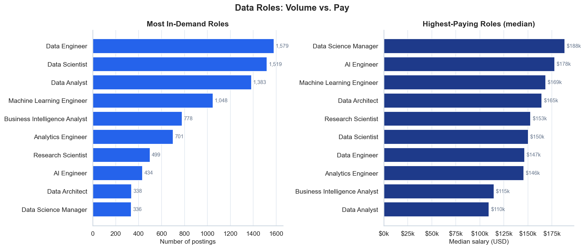
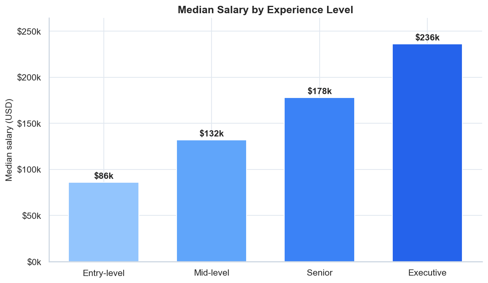
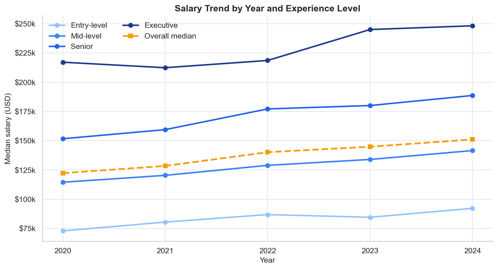
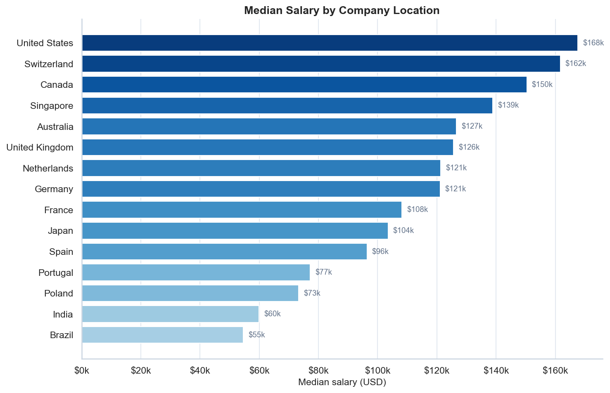

# Data Job Market Analysis

**An end-to-end data analysis case study: what drives salaries for data professionals?**

This project is a Jupyter Notebook case study that walks through the complete
analytical workflow — **collect → clean → explore → visualize → conclude** — on the
job market for data roles. It is written to show *how I think*, not just what I can
plot: every step is explained (the *why*), and every section ends with a clear
finding in plain English.

> 📓 **Read the full analysis:**
> [**`notebooks/data_job_market_analysis.ipynb`**](notebooks/data_job_market_analysis.ipynb)
> — GitHub renders the notebook (charts included) right in your browser, no setup
> required. For a faster, cleaner render you can also open it via
> [**nbviewer**](https://nbviewer.org/github/CoreLogicLabs/data-job-market-analysis/blob/main/notebooks/data_job_market_analysis.ipynb).

---

## Questions answered

1. Which job titles are most **in demand**, and which **pay the most**?
2. How strongly does **experience level** drive salary?
3. Does **remote work** carry a salary premium?
4. How do salaries differ by **country / location**?
5. What is the **salary trend** over recent years?
6. Does **company size** affect pay?

## Key findings (at a glance)

| # | Insight | Evidence |
|---|---------|----------|
| 1 | **Experience is the #1 pay lever** | Entry-level **~$86k** → Executive **~$236k** (**≈2.7×**) |
| 2 | **Location sets the ceiling** | US **~$168k** & Switzerland **~$162k** vs India **~$60k** / Brazil **~$55k** (**≈3×**) |
| 3 | **Demand ≠ pay** | Most common role (Data Analyst, **~$110k**) is the *lowest*-paid; top pay goes to Data Science Manager (**~$188k**) & AI Engineer (**~$178k**) |
| 4 | **Remote premium is small** | Remote **~$145k** vs Onsite **~$139k** (**≈5%**) |
| 5 | **Salaries are trending up** | Overall median **+23.5%** from 2020 (~$122k) to 2024 (~$151k) |
| 6 | **Company size matters least** | Large **~$153k** vs Small **~$126k** |

*Based on **8,615** cleaned salary records.*

---

## A few of the visuals

**Volume vs. pay — the most common roles are not the best paid**


**Experience is the steepest gradient in the data**


**Salaries have climbed steadily, at every level**


**Geography sets the ceiling**


---

## About the data (full transparency)

This project uses **two data layers**, each chosen deliberately and described
honestly.

### 1. Ethical web-scraping demo
To demonstrate data-collection skill, [`src/scraper.py`](src/scraper.py) scrapes
[realpython.github.io/fake-jobs](https://realpython.github.io/fake-jobs/) — a
**sandbox site built specifically for scraping practice**. It contains fabricated
postings and is meant to be scraped, so the exercise is legal and ToS-friendly
(unlike scraping live commercial job boards). The scraper follows respectful
practices: an honest `User-Agent`, a polite delay between requests, timeouts and
error handling, and it collects only the fields it needs.

### 2. Salary dataset — synthetic, but realistic (and labelled as such)
The core analysis uses a dataset with the **same schema as Kaggle's
["Data Science Job Salaries"](https://www.kaggle.com/datasets/arnabchaki/data-science-salaries-2023)**
dataset (`work_year`, `experience_level`, `employment_type`, `job_title`,
`salary_in_usd`, `employee_residence`, `remote_ratio`, `company_location`,
`company_size`).

It is **synthetic**, generated by [`src/generate_data.py`](src/generate_data.py)
from documented, realistic assumptions — a seniority premium, geographic
differences, a modest remote premium, year-over-year growth, and a company-size
effect — with a fixed random seed so the numbers are **identical on every run**.
The generator also injects a small amount of intentional "dirt" (duplicates,
missing values, data-entry outliers) so the cleaning step is genuine.

**Why synthetic?** To keep the repository fully self-contained and free of
data-licensing/redistribution concerns. The point of the case study is the
**analytical workflow**, which transfers directly to the real Kaggle dataset — only
the `pd.read_csv` source would change.

---

## Tech stack

- **Python** — analysis language
- **pandas** / **numpy** — data wrangling & aggregation
- **requests** / **BeautifulSoup** — ethical web scraping
- **matplotlib** / **seaborn** — visualization (consistent blue-led palette)
- **Jupyter** — the notebook itself

## Project structure

```
data-job-market-analysis/
├── notebooks/
│   └── data_job_market_analysis.ipynb   # the case study (read this)
├── src/
│   ├── scraper.py                        # ethical scraping demo
│   └── generate_data.py                  # synthetic salary dataset generator
├── data/
│   ├── raw/                              # scraped + generated raw data
│   └── processed/                        # cleaned, analysis-ready data
├── assets/                              # exported charts (used in this README)
├── requirements.txt
├── README.md
└── .gitignore
```

---

## How to run it

```bash
# 1. (optional) create and activate a virtual environment
python -m venv .venv
source .venv/bin/activate        # Windows: .venv\Scripts\activate

# 2. install dependencies
pip install -r requirements.txt

# 3. (optional) regenerate the source data from scratch
python src/scraper.py            # scrapes the sandbox site -> data/raw/
python src/generate_data.py      # builds the synthetic salary set -> data/raw/

# 4. launch Jupyter and open the notebook
jupyter notebook notebooks/data_job_market_analysis.ipynb
```

### Reproduce every cell and save the outputs
To run the whole notebook top-to-bottom and save it **with all outputs and charts
embedded** (so it renders fully on GitHub), either:

- In Jupyter: **Kernel → Restart & Run All**, then **File → Save**, **or**
- From the command line:

```bash
jupyter nbconvert --to notebook --execute --inplace \
  notebooks/data_job_market_analysis.ipynb
```

Because all randomness is seeded, every number, table and chart reproduces
**exactly**.

> **Note:** the data files in `data/` and the charts in `assets/` are committed so
> the notebook and README render immediately on GitHub — there is nothing to run
> just to view the results.

---

*Author: **Deniz A.** — portfolio case study. The salary dataset is synthetic and
clearly labelled as such; the analytical workflow mirrors a real client engagement.*
